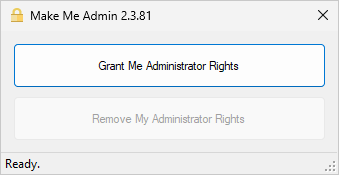
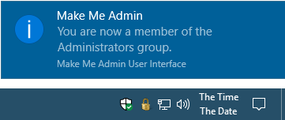
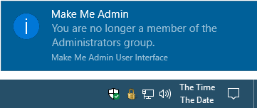
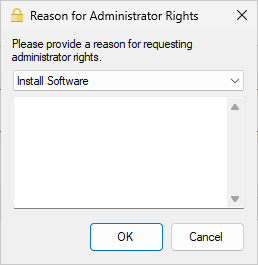

## How It Works

The user launches the Make Me Admin application. If they are authorized to obtain administrator rights, and they are not already an administrator, the “Grant Me Administrator Rights” button is enabled.

When the user clicks the Grant button, a service, running in the background, adds the user to the Administrators group. The user application notifies the user, and it minimizes to the notification area.

At this point, the user can perform the actions that require administrator rights. When prompted for credentials, they simply enter their current Windows credentials.

After a configurable period, the user is removed from the Administrators group by the service. The user is notified of this, and the application closes.

Optionally, a prompt for the user to provide justification for administrator rights can be configured.

[home](/ "Make Me Admin home page")