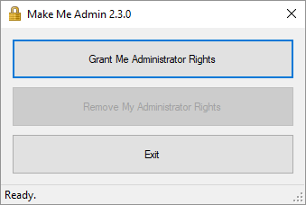

You can download installers for the latest version, 2.3, from [the GitHub repository](https://github.com/pseymour/MakeMeAdmin/tree/v2.3-fr/Installers "Make Me Admin 2.3 installers").

If you prefer Chocolatey, teknowledgist has created a [package](https://chocolatey.org/packages/makemeadmin/2.3 "Chocolatey package for Make Me Admin 2.3") for Make Me Admin 2.3.

[Browse the documention](documentation.md)

 Make Me Admin is released under the GNU General Public License, version 3.
